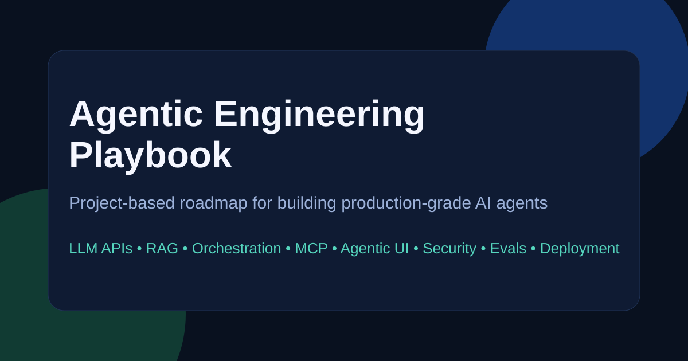
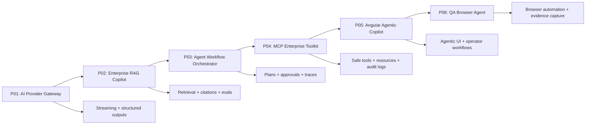

# Agentic Engineering Playbook

[](https://github.com/AnkitParekh007/Agentic-Engineering-Playbook/actions/workflows/ci.yml)
[](https://github.com/AnkitParekh007/Agentic-Engineering-Playbook/actions/workflows/deploy-pages.yml)
[](./LICENSE)
[](https://ankitparekh007.github.io/Agentic-Engineering-Playbook/)
[](https://github.com/AnkitParekh007/Agentic-Engineering-Playbook)
[](https://ankitparekh007.github.io/Agentic-Engineering-Playbook/)

A premium open-source AI engineering academy for developers who want to build production-grade agents, copilots, RAG systems, MCP integrations, eval pipelines, observability layers, and agentic UI through runnable projects.

Live docs: [ankitparekh007.github.io/Agentic-Engineering-Playbook](https://ankitparekh007.github.io/Agentic-Engineering-Playbook/)

## Build premium AI engineering skill through runnable systems

Agentic Engineering Playbook is a project-first curriculum for developers, contributors, learners, and recruiters who want evidence of real AI engineering work rather than prompt-only demos.

- Learn through six runnable projects
- Study production tradeoffs in docs that stay close to implementation
- Contribute new chapters, diagrams, examples, and project upgrades
- Use the repo as a public proof-of-work system for AI engineering skill

### Start here

- Live docs: [Explore the academy](https://ankitparekh007.github.io/Agentic-Engineering-Playbook/)
- Contributor onboarding: [Start Here Contributor Guide](./docs/start-here/start-here-contributor-guide.md)
- Curriculum roadmap: [Learning Path](./docs/start-here/learning-path.md)
- Angular track: [Learning Path: Angular AI Engineer](./docs/start-here/learning-path-angular-ai-engineer.md)
- Agent track: [Learning Path: AI Agentic Engineer](./docs/start-here/learning-path-ai-agentic-engineer.md)

## Visual preview



## What this is

Agentic Engineering Playbook is a practical Docusaurus curriculum focused on production-grade AI application development. It covers the path from direct LLM API usage to RAG, orchestration, MCP, agentic UI, production security, evals, observability, deployment, and commercialization.

- Docs site: [Explore the live academy](https://ankitparekh007.github.io/Agentic-Engineering-Playbook/)
- GitHub: [View the repository](https://github.com/AnkitParekh007/Agentic-Engineering-Playbook)

## Quick start

```bash
npm install
npm run start
npm run build
```

For a production-faithful local preview:

```bash
npm run build
npm run serve
```

Open the local site and start with the roadmap:

- [Learning Path](./docs/start-here/learning-path.md)
- [Project Ladder](./docs/start-here/project-ladder.md)
- [Start Here Contributor Guide](./docs/start-here/start-here-contributor-guide.md)

## What you will build: visual map



## Launch status

- 6 runnable AI systems are implemented
- GitHub Pages is live
- CI covers docs plus safe local validation across the six projects
- real launch screenshots are now captured locally for the homepage, docs, Angular copilot, and QA report
- walkthrough GIFs are still an optional follow-up asset

## Screenshots / demo assets

- social preview card in [`static/img/social-card.svg`](./static/img/social-card.svg)
- homepage dark capture in [`static/img/screenshots/homepage-dark.png`](./static/img/screenshots/homepage-dark.png)
- homepage light capture in [`static/img/screenshots/homepage-light.png`](./static/img/screenshots/homepage-light.png)
- Angular Copilot capture in [`static/img/screenshots/angular-copilot-demo.png`](./static/img/screenshots/angular-copilot-demo.png)
- QA Browser Agent report capture in [`static/img/screenshots/qa-browser-report.png`](./static/img/screenshots/qa-browser-report.png)
- project doc dark-mode capture in [`static/img/screenshots/project-doc-page-dark.png`](./static/img/screenshots/project-doc-page-dark.png)
- local QA Browser Agent reports and screenshots are generated by Project 06 and intentionally ignored from Git

## Visual system

- Inter for product and documentation typography
- JetBrains Mono for commands, code, and runtime surfaces
- dark-first AI-native theme with readable light-mode fallback
- reusable cards, badges, layout utilities, and MDX-friendly docs components
- visual QA checklist in [`docs/open-source/visual-quality-checklist.md`](./docs/open-source/visual-quality-checklist.md)

## Completed projects

| # | Project | What it teaches | Status | Link |
| --- | --- | --- | --- | --- |
| 01 | AI Provider Gateway | provider abstraction, streaming, structured outputs, tracing | Complete | [Open](./projects/p01-ai-provider-gateway/README.md) |
| 02 | Enterprise RAG Copilot | chunking, retrieval, citations, evals | Complete | [Open](./projects/p02-enterprise-rag-copilot/README.md) |
| 03 | Agent Workflow Orchestrator | state machines, approvals, retries, inspectable traces | Complete | [Open](./projects/p03-agent-workflow-orchestrator/README.md) |
| 04 | MCP Enterprise Toolkit | safe tool interfaces, resources, audit logging, read-only MCP-style patterns | Complete | [Open](./projects/p04-mcp-enterprise-toolkit/README.md) |
| 05 | Angular Agentic Copilot | operator UX, streaming UI, approvals, session state | Complete | [Open](./projects/p05-angular-agentic-copilot/README.md) |
| 06 | QA Browser Agent | safe browser automation, Playwright evidence capture, dry-run policy | Complete | [Open](./projects/p06-qa-browser-agent/README.md) |

## What you will build

1. a provider gateway that normalizes model calls
2. a retrieval copilot with local evals
3. an orchestration runtime with approval states
4. an MCP-style enterprise tool layer
5. an Angular copilot shell for operator-facing AI UX
6. a safe QA browser agent with local evidence capture

## Who should use this

- software engineers moving into AI product engineering
- full-stack developers building internal copilots
- founders validating agentic products
- consultants building enterprise AI delivery capability

## What makes this different

- project-first instead of notes-first
- practical enterprise examples
- TypeScript-first with Python where useful
- security, evals, observability, and deployment included in the main path
- designed to create hiring signal, consulting leverage, and product-ready ideas

## Why star, watch, or fork

- Star the repo if you want a practical open-source AI engineering curriculum to keep improving in public.
- Watch the repo if you want updates as new chapters, projects, challenges, and contributor workflows are added.
- Fork the repo if you want a personalized learning academy, an internal enablement version, or a portfolio variant tied to your own projects.

## Recruiter value

This repository is useful to recruiters and hiring managers because it makes AI engineering skill visible in public:

- docs show architecture thinking, production constraints, and system boundaries
- projects show runnable implementation skill across backend, UI, evals, and deployment
- contribution guides and templates show collaboration readiness
- the learning paths make it easy to evaluate focus areas such as Angular AI engineering, agent orchestration, RAG, MCP, and observability

The repo does not claim student counts, adoption, or revenue. Its value is practical proof of work.

## 90-day roadmap

### Days 1-30

- finish LLM foundations and provider gateway work
- learn prompt contracts, structured outputs, and streaming
- publish the first architecture note and demo

### Days 31-60

- build the enterprise RAG copilot
- add retrieval quality thinking, citations, and evals
- document tradeoffs, metrics, and failure modes

### Days 61-90

- build orchestration, MCP, agentic UI, and deployment layers
- add approvals, traces, and production hardening
- package the strongest projects into portfolio-ready public assets

## Repository structure

```text
docs/        Curriculum chapters and roadmap content
projects/    Project briefs and starter implementations
src/         Docusaurus site source
static/      Site assets
templates/   Reusable prompts, checklists, and diagrams
```

## Community growth docs

- [Contribute a Chapter](./docs/open-source/contribute-a-chapter.md)
- [Weekly Challenge](./docs/open-source/weekly-challenge.md)
- [Project Submission Template](./docs/open-source/project-submission-template.md)
- [Contributor Roadmap](./CONTRIBUTOR_ROADMAP.md)
- [Launch Plan](./LAUNCH_PLAN.md)

## Run all checks

Root docs:

```bash
npm run build
```

Project checks:

```bash
cd projects/p01-ai-provider-gateway && npm run typecheck && npm run build && npm run smoke
cd ../p02-enterprise-rag-copilot && npm run typecheck && npm run build && npm run smoke && npm run eval
cd ../p03-agent-workflow-orchestrator && npm run typecheck && npm run build && npm run smoke && npm run eval
cd ../p04-mcp-enterprise-toolkit && npm run typecheck && npm run build && npm run smoke && npm run eval
cd ../p05-angular-agentic-copilot && npm run build && npm run smoke
cd ../p06-qa-browser-agent && npm run typecheck && npm run build && npm run smoke && npm run eval
```

CI covers the same safe checks on pull requests and pushes to `main`. Project 06 deliberately keeps `browser-smoke` out of CI so the pipeline stays deterministic and does not depend on a browser install or external targets.

## Deployment

The repository includes:

- CI build validation on `push` and `pull_request`
- GitHub Pages deployment from `main`
- a Docusaurus config already aligned to `AnkitParekh007/Agentic-Engineering-Playbook`

If GitHub Pages is not live yet, enable it in repository settings and choose **GitHub Actions** as the source.

## Contributing

Contributions are welcome for curriculum accuracy, code examples, diagrams, Docusaurus improvements, and starter project scaffolding.

- Read [CONTRIBUTING.md](./CONTRIBUTING.md)
- Start with [Start Here Contributor Guide](./docs/start-here/start-here-contributor-guide.md)
- Use [Contribute a Chapter](./docs/open-source/contribute-a-chapter.md) for content PRs
- Use [Project Submission Template](./docs/open-source/project-submission-template.md) when proposing a runnable project
- Open an issue for curriculum gaps or implementation bugs
- Send a PR for docs fixes, build improvements, or new examples

## Launch and community CTA

If this repository is useful:

- star it to support the project
- watch it for roadmap updates
- fork it to build your own learning track or internal variant
- share it with developers who want to move from AI demos to real systems

## License

MIT
