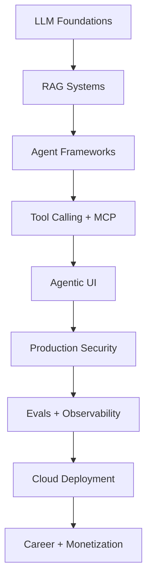

# Learning Path

```mermaid
flowchart TD
  A[LLM Foundations] --> B[RAG Systems]
  B --> C[Agent Frameworks]
  C --> D[Tool Calling + MCP]
  D --> E[Agentic UI]
  E --> F[Production Security]
  F --> G[Evals + Observability]
  G --> H[Cloud Deployment]
  H --> I[Career + Monetization]
```

## Core principle

Do not learn agents by reading only. Learn by building one useful system per layer.
