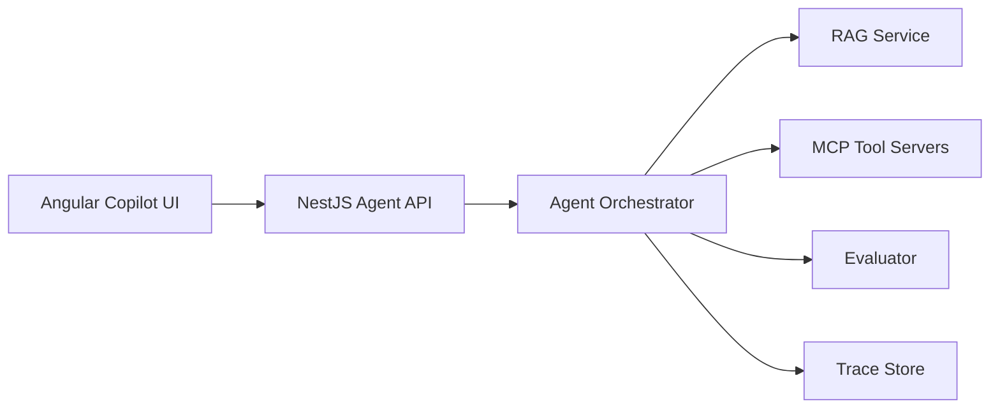

# Project Ladder

| Level | Project | What it proves |
|---|---|---|
| 1 | AI Provider Gateway | You can call models safely and consistently |
| 2 | Enterprise RAG Copilot | You can ground answers in real knowledge |
| 3 | Agent Orchestrator | You can manage stateful workflows |
| 4 | MCP Toolkit | You can connect agents to external tools |
| 5 | Angular Agentic Copilot | You can build real AI-native product UX |
| 6 | QA Browser Agent | You can automate real application tasks |

## Final capstone

Combine all projects into one platform:

