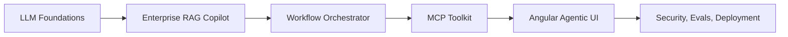

# Vision

Agentic engineering is the discipline of building software systems where language models reason, call tools, retrieve context, ask for approval, and operate inside real product constraints.

## What this playbook is

This repository is a practical learning platform for developers who want to become production-ready AI Agentic Engineers. It is not a prompt collection and not a theory-first AI notes repo. The output is a public body of work: systems, diagrams, evaluations, demos, and deployable code.

## Who it is for

- backend engineers moving into AI products
- frontend engineers building copilot experiences
- full-stack engineers shipping internal AI tools
- founders validating agentic SaaS products
- consultants building enterprise AI delivery capability

## What you will build

- a provider gateway with structured outputs and streaming
- a RAG copilot with citations and retrieval controls
- a LangGraph-style orchestrator with tool execution and approvals
- an MCP toolkit that exposes enterprise-safe tools
- an Angular-based operator UI for agent state and approvals
- production controls for evals, observability, CI/CD, and deployment

## Product standard

Every module should answer:

- what problem are we solving?
- what code would a real team ship?
- how does it fail in production?
- what artifact goes into the portfolio?
- how could this become a product or service?

## Success definition

By the end of the playbook, a learner should be able to:

- design an agentic system architecture
- implement core flows in TypeScript and Python
- explain tradeoffs around tools, context, retrieval, and approvals
- instrument evals, costs, traces, and release quality
- publish a serious GitHub portfolio that signals applied AI engineering ability
