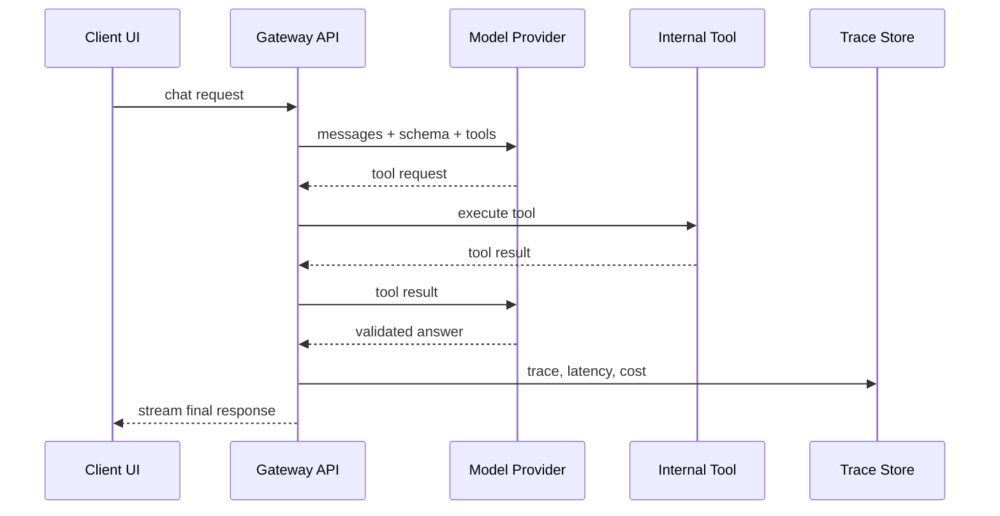

# Layer 1: LLM Foundations

## Beginner explanation

An LLM application is not just “send prompt, get text.” A real system manages provider choice, message formatting, prompt contracts, structured outputs, retries, streaming, and error handling.

## Production explanation

Production teams need a gateway layer so the product is not tightly coupled to one provider SDK. That layer should normalize request shape, output validation, latency logging, cost tracking, and fallback behavior.

## Enterprise example

A support operations assistant receives a customer question, checks order data through a tool, and returns a structured answer that can be rendered in the UI and audited later.

## Architecture diagram



## TypeScript example

```ts
type ChatResult = {
  answer: string;
  escalationRequired: boolean;
};

export async function runSupportReply(messages: Array<{ role: string; content: string }>): Promise<ChatResult> {
  const response = await gateway.responses.create({
    model: 'gpt-4.1-mini',
    input: messages,
    text: {
      format: {
        type: 'json_schema',
        name: 'support_reply',
        schema: {
          type: 'object',
          properties: {
            answer: { type: 'string' },
            escalationRequired: { type: 'boolean' },
          },
          required: ['answer', 'escalationRequired'],
          additionalProperties: false,
        },
      },
    },
  });

  return JSON.parse(response.output_text) as ChatResult;
}
```

## Python example

```python
from pydantic import BaseModel

class SupportReply(BaseModel):
    answer: str
    escalation_required: bool

def parse_support_reply(payload: dict) -> SupportReply:
    return SupportReply.model_validate(payload)
```

## Common mistakes

- coupling business code directly to one provider SDK
- trusting free-form text when the UI needs structured state
- skipping retry and timeout policy
- streaming text without tracking partial failures

## Mini exercise

Build a `/chat` endpoint that always returns `answer`, `confidence`, and `needsHumanReview` as validated JSON.

## Project assignment

Implement the first milestone of [Project: AI Provider Gateway](./project-ai-provider-gateway.md): one provider, one schema, one streamed endpoint, one trace record.

## Interview questions

- Why is a provider gateway useful even for a single-model product?
- When should you prefer structured output over prompt-only formatting?
- What data would you log for each model call?

## Monetization angle

Teams routinely need a reusable AI gateway layer for multiple internal use cases. This can become a consulting starter package, internal platform component, or developer template.
