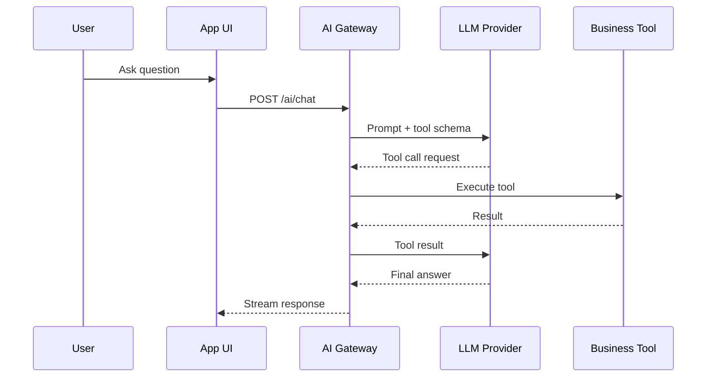

# Layer 1: LLM Foundations

Before using agent frameworks, you must understand how LLM applications work directly.

## Concepts

- providers
- chat messages
- system prompts
- tool calling
- structured output
- streaming
- retries
- token usage
- cost tracking
- error handling

## Real-life example

A support agent receives a user question, identifies intent, calls an order-status tool, streams progress to the UI, and returns a structured response.

