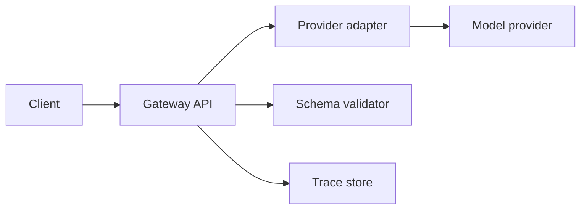

# Project: AI Provider Gateway

- **Difficulty:** Intermediate
- **Primary stack:** TypeScript API, optional Python worker
- **Estimated duration:** 1 to 2 weeks
- **Primary hiring signal:** LLM backend architecture
- **Primary monetization signal:** reusable AI platform starter

## Problem statement

Teams need one API surface for model calls, not provider-specific logic scattered across the product.

## Core workflows

- accept normalized chat requests
- route to a selected provider
- stream partial output
- validate final structured output
- log cost, latency, and errors

## Architecture

## Milestones

1. Single provider, single schema, non-streaming response
2. Add streaming transport
3. Add second provider adapter
4. Add tracing, retries, and fallback strategy

## Acceptance criteria

- one endpoint supports validated JSON output
- one streamed endpoint emits partial tokens or events
- at least two provider adapters share one interface
- every run logs latency and estimated cost

## Portfolio packaging

Show provider abstraction design, schema validation, trace screenshots, and a side-by-side provider comparison.

## Monetization path

This project can become an internal gateway product, consulting accelerator, or open-core template with enterprise logging and guardrails.
