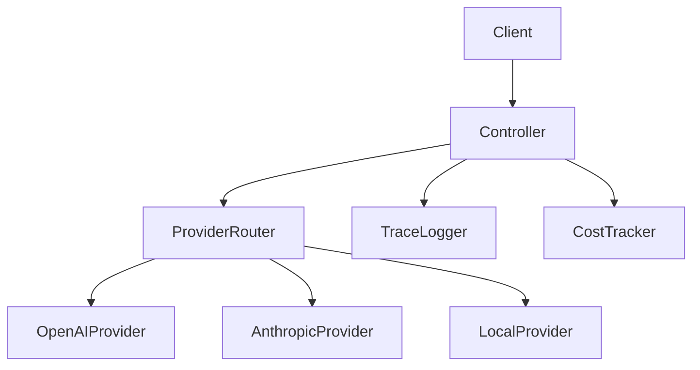

# Project: AI Provider Gateway

## Goal

Build a small provider gateway that abstracts OpenAI, Anthropic, and local models.

## Features

- `POST /ai/chat`
- `POST /ai/chat/stream`
- `POST /ai/structured-output`
- provider switch
- retry policy
- timeout policy
- token usage logging
- trace ID per request

## Architecture

## Portfolio output

Publish this as your first repo and explain why provider abstraction matters for enterprise AI applications.
