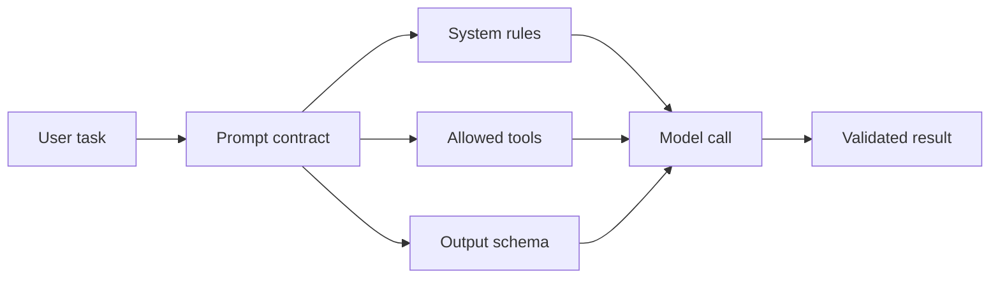

# Prompt Contracts

## Beginner explanation

A prompt contract defines the job, boundaries, and output shape for one model interaction. It turns “ask the model something” into an engineering interface that other code can depend on.

## Production explanation

In production, prompt contracts reduce ambiguity between product logic and model behavior. They make it easier to version prompts, validate responses, compare models, and debug failures when outputs drift.

## Real-world enterprise example

A migration assistant helps an engineering team plan an Angular upgrade. One contract is for planning only, another for code review suggestions, and a third for structured risk reporting. Each contract has different tools and safety rules.

## Mermaid diagram



## TypeScript example

```ts
export interface PromptContract<TOutput> {
  name: string;
  system: string;
  userTemplate: (input: { task: string }) => string;
  tools: string[];
  outputSchemaName: string;
  parse: (json: unknown) => TOutput;
}

type MigrationPlan = {
  summary: string;
  steps: string[];
  risks: string[];
};
```

## Python example

```python
from dataclasses import dataclass

@dataclass
class PromptContract:
    name: str
    system: str
    allowed_tools: list[str]
    output_schema_name: str
```

## Common mistakes

- mixing planning and execution in one contract
- letting the output format live only in prose
- reusing one generic system prompt for unrelated tasks
- failing to version the contract when behavior changes

## Mini exercise

Write three contracts for the same feature: `ask`, `plan`, and `execute`. Decide which one can call tools and which one must stay read-only.

## Project assignment

Create prompt contracts for planning, answer generation, and escalation in [Project: AI Provider Gateway](./project-ai-provider-gateway.md).

## Interview questions

- Why is a prompt contract more useful than a raw prompt string?
- When should two adjacent tasks use separate contracts?
- What belongs in code versus prose inside a contract?

## Monetization angle

Reusable prompt contracts are part of the delivery IP that makes an AI consulting engagement faster, safer, and easier to maintain.
