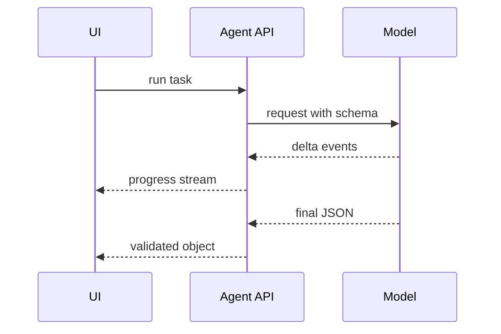

# Streaming and Structured Output

## Beginner explanation

Streaming improves responsiveness for humans. Structured output improves reliability for software. Strong AI products usually need both.

## Production explanation

A production system often streams tokens or events to the UI while also requiring a final machine-readable object for state updates, tool orchestration, or downstream automation.

## Real-world enterprise example

A QA assistant streams test progress to the operator interface but returns the final result as a validated bug report with severity, reproduction steps, and evidence links.

## Mermaid diagram



## TypeScript example

```ts
export interface AgentPlan {
  goal: string;
  steps: Array<{
    id: string;
    title: string;
    requiresApproval: boolean;
  }>;
  riskLevel: 'low' | 'medium' | 'high';
}

export function onPlanDelta(text: string) {
  return { type: 'message.delta', text };
}
```

## Python example

```python
from pydantic import BaseModel

class BugReport(BaseModel):
    title: str
    severity: str
    reproduction_steps: list[str]
    evidence_urls: list[str]
```

## Common mistakes

- streaming raw text when the UI really needs typed events
- accepting malformed final JSON because “the answer looked right”
- not defining what happens if streaming succeeds but final validation fails
- using structured output only at the very end instead of across important checkpoints

## Mini exercise

Design one stream event format and one final JSON schema for an approval-based workflow.

## Project assignment

Implement streamed progress events and a validated final object in [Project: Angular Agentic Copilot](../05-agentic-ui/project-angular-agentic-copilot.md).

## Interview questions

- Why do streaming and structured output solve different problems?
- When should progress be event-based instead of token-based?
- What should happen after schema validation failure?

## Monetization angle

Teams pay for AI features that feel responsive and can be safely integrated into business workflows. Streaming plus structured output is a key part of that value.
