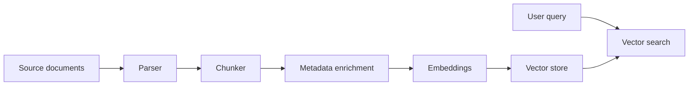

# Chunking, Embeddings, and Vector Search

## Beginner explanation

RAG works only if documents are split into useful pieces. Chunking creates those pieces, embeddings make them searchable by meaning, and vector search finds the closest matches.

## Production explanation

Real systems treat chunking as a content engineering problem. The chunk boundary affects retrieval quality, citation clarity, token cost, and how often the model hallucinates from weak context.

## Real-world enterprise example

A policy assistant indexes HR handbooks, travel policy PDFs, and onboarding guides. Chunks must preserve section titles and document version so answers can cite the right rule.

## Mermaid diagram



## TypeScript example

```ts
export interface ChunkMetadata {
  sourceId: string;
  title: string;
  section: string;
  sourceType: 'doc' | 'ticket' | 'code' | 'transcript';
  updatedAt?: string;
}

export function chunkDocument(text: string, chunkSize = 800): string[] {
  const parts: string[] = [];
  for (let i = 0; i < text.length; i += chunkSize) {
    parts.push(text.slice(i, i + chunkSize));
  }
  return parts;
}
```

## Python example

```python
def sliding_window_chunks(text: str, size: int = 800, overlap: int = 120) -> list[str]:
    chunks = []
    start = 0
    while start < len(text):
        end = start + size
        chunks.append(text[start:end])
        start += size - overlap
    return chunks
```

## Common mistakes

- chunks that are too large to stay semantically tight
- chunks that lose section headers and source identity
- storing embeddings without enough metadata for filtering and debugging
- indexing OCR noise and layout artifacts as if they were real content

## Mini exercise

Test three chunking strategies on one document and compare which one produces the clearest citations for five sample questions.

## Project assignment

Define your ingestion chunk format and metadata schema for [Project: Enterprise RAG Copilot](./project-enterprise-rag-copilot.md).

## Interview questions

- What tradeoffs change when chunk size gets larger or smaller?
- Why is overlap sometimes useful?
- What metadata is essential for production debugging?

## Monetization angle

Document ingestion quality is one of the least visible and most valuable parts of enterprise RAG work. Teams often underestimate how much this determines outcomes.
