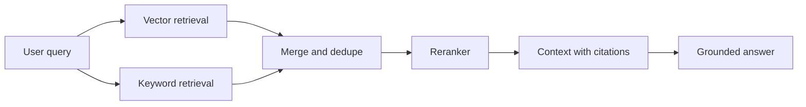

# Hybrid Search, Reranking, and Citations

## Beginner explanation

Hybrid search combines semantic and keyword retrieval. Reranking improves the final ordering. Citations make the answer auditable.

## Production explanation

Many enterprise questions depend on exact terms, identifiers, and policy language. That is why vector search alone is often insufficient. Hybrid retrieval plus reranking is a more reliable default for serious knowledge systems.

## Real-world enterprise example

A legal ops assistant must find the correct clause for “termination for convenience” even when the user phrases it differently and the original contract uses a very specific legal expression.

## Mermaid diagram



## TypeScript example

```ts
export async function hybridRetrieve(query: string) {
  const [vectorHits, keywordHits] = await Promise.all([
    vectorIndex.search(query, { topK: 10 }),
    keywordIndex.search(query, { topK: 10 }),
  ]);

  const merged = [...vectorHits, ...keywordHits];
  return rerank(query, merged).then((items) => items.slice(0, 5));
}
```

## Python example

```python
def refusal_for_low_evidence(score: float) -> str | None:
    if score < 0.55:
        return "I could not find enough reliable information in the available sources."
    return None
```

## Common mistakes

- returning citations that do not actually support the answer
- using reranking but not measuring whether it improved retrieval quality
- merging duplicate chunks without preserving source metadata
- never refusing when evidence is weak

## Mini exercise

Take ten sample queries and record whether vector-only, keyword-only, or hybrid retrieval found the best chunk first.

## Project assignment

Add hybrid retrieval, reranking, and refusal behavior to [Project: Enterprise RAG Copilot](./project-enterprise-rag-copilot.md).

## Interview questions

- When is keyword retrieval more important than semantic retrieval?
- What does a good citation experience look like for users?
- How would you test whether reranking is worth the added cost?

## Monetization angle

Grounded answers with reliable citations are a major trust differentiator. This is often the line between a demo and an enterprise pilot.
