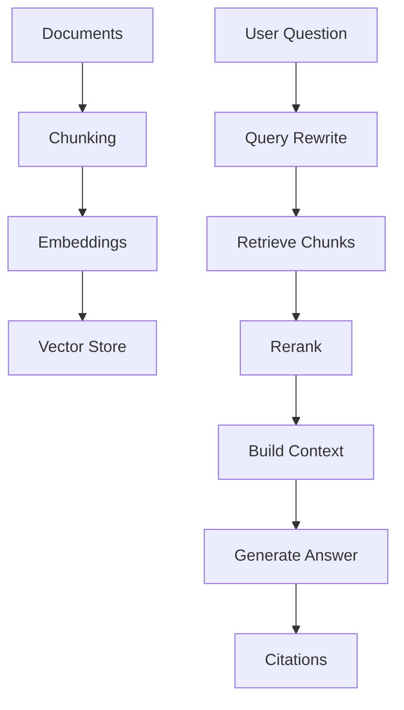

# Layer 2: RAG Systems

RAG means Retrieval-Augmented Generation. It gives the model relevant knowledge before it answers.

## Why RAG matters

Without RAG, the agent guesses. With RAG, the agent can cite internal docs, policies, tickets, code, and product knowledge.

## Core pipeline

## Real-life example

A supplier portal user asks: “How do I upload product data?” The RAG system retrieves the correct upload workflow docs and returns an answer with citations.
