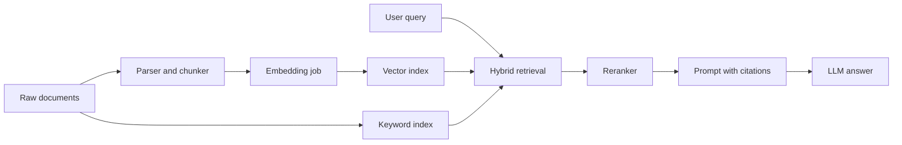

# Layer 2: RAG Systems

## Beginner explanation

RAG adds external knowledge to a model response. Instead of hoping the model remembers a fact, you retrieve the relevant source material and ask the model to answer from that evidence.

## Production explanation

Production RAG is a pipeline: ingestion, parsing, chunking, embedding, indexing, retrieval, reranking, prompt assembly, citations, and evaluation. Most failures come from bad retrieval quality, weak grounding rules, or poor content preprocessing.

## Enterprise example

An HR policy copilot answers questions about travel, expense, and leave policy. Every answer must cite the exact policy snippet and document version.

## Architecture diagram



## TypeScript example

```ts
export async function retrieveContext(query: string) {
  const [vectorHits, keywordHits] = await Promise.all([
    vectorStore.search(query, { topK: 12 }),
    keywordStore.search(query, { topK: 12 }),
  ]);

  const merged = dedupeById([...vectorHits, ...keywordHits]);
  return reranker.rank(query, merged).then((ranked) => ranked.slice(0, 5));
}
```

## Python example

```python
def build_grounded_prompt(question: str, chunks: list[dict]) -> str:
    context = "\n\n".join(
        f"[{item['source']}] {item['text']}" for item in chunks
    )
    return (
        "Answer only from the provided context.\n"
        "If the answer is missing, say you do not have enough evidence.\n\n"
        f"Question: {question}\n\nContext:\n{context}"
    )
```

## Common mistakes

- indexing raw PDFs without cleaning layout noise
- using chunk sizes that destroy meaning boundaries
- showing citations that are not actually tied to the answer
- evaluating only answer quality, not retrieval quality

## Mini exercise

Take one policy PDF, split it into chunks with metadata, and compare keyword retrieval versus vector retrieval on five sample questions.

## Project assignment

Build the ingestion and retrieval core for [Project: Enterprise RAG Copilot](./project-enterprise-rag-copilot.md), including chunk metadata, hybrid retrieval, and citation formatting.

## Interview questions

- Why do many enterprise RAG systems use hybrid retrieval instead of vector-only search?
- What metadata is most useful to store on each chunk?
- How would you detect retrieval drift after a content update?

## Monetization angle

Enterprise knowledge copilots are one of the fastest paths to paid AI work because every company has fragmented documentation and expensive internal search failure.
