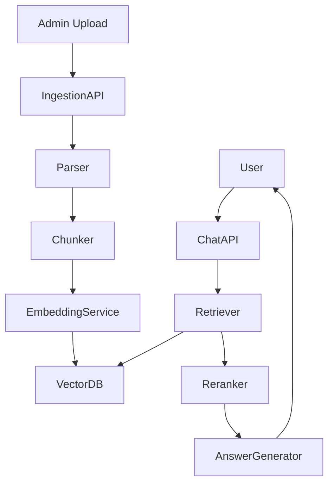

# Project: Enterprise RAG Copilot

## Goal

Build a RAG copilot that can answer questions from uploaded documentation.

## Features

- upload documents
- ingest documents
- create chunks
- generate embeddings
- store vectors
- search semantically
- rerank results
- answer with citations
- show retrieved context
- collect feedback

## Architecture

## Portfolio output

Create a demo where users upload docs and ask questions with citations.
