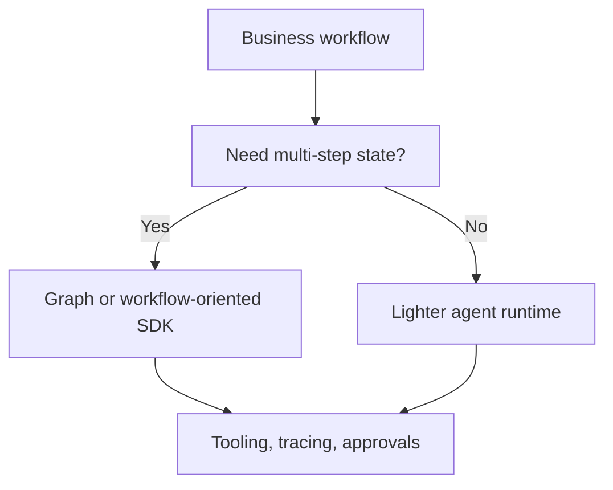

# CrewAI, OpenAI Agents SDK, and Google ADK

## Beginner explanation

Frameworks are not the product. They are implementation choices for structuring tools, memory, orchestration, and agent roles.

## Production explanation

Framework selection should follow system requirements: statefulness, tool complexity, observability, deployment targets, and how much abstraction your team wants to own versus outsource.

## Real-world enterprise example

A platform team evaluating internal agent tooling compares frameworks based on approval support, tool integration ergonomics, run tracing, and how easily workflows can be reviewed by backend engineers.

## Mermaid diagram



## TypeScript example

```ts
type FrameworkFit = {
  name: string;
  strengths: string[];
  risks: string[];
};

const candidates: FrameworkFit[] = [
  { name: 'Workflow-oriented runtime', strengths: ['state', 'replay'], risks: ['more setup'] },
  { name: 'Light agent SDK', strengths: ['speed', 'simplicity'], risks: ['less explicit state'] },
];
```

## Common mistakes

- choosing a framework before defining workflow requirements
- assuming multi-agent equals better architecture
- relying on framework defaults for safety or observability
- locking into abstractions the team cannot debug

## Mini exercise

Pick one project in this playbook and write a short framework selection memo with criteria, constraints, and why a simpler or more explicit runtime is a better fit.

## Project assignment

Define the runtime selection criteria for [Project: Agent Workflow Orchestrator](./project-langgraph-orchestrator.md).

## Interview questions

- How would you choose between a lightweight agent SDK and a graph-based runtime?
- What framework concerns become important in production but not in demos?
- Why can multi-agent design increase complexity faster than value?

## Monetization angle

Framework selection guidance is part of architecture consulting. Many teams need help making a durable choice before they build themselves into a corner.
