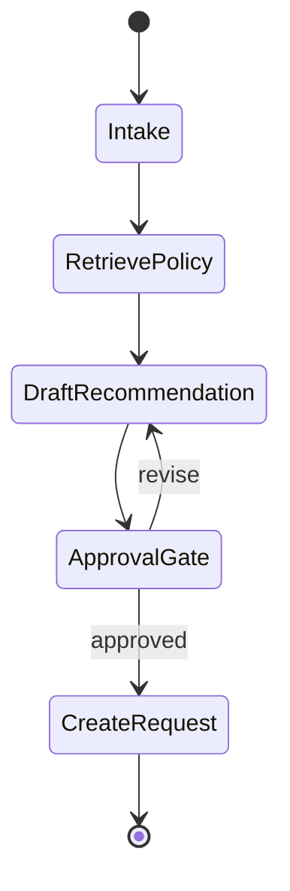

# LangGraph-Style State Machines

## Beginner explanation

A state machine breaks an agent workflow into explicit steps and transitions. That makes the system understandable instead of magical.

## Production explanation

State machines matter when a workflow spans multiple tool calls, retries, approvals, or recoverable failure paths. They give you resumability, traceability, and cleaner separation between planning and execution.

## Real-world enterprise example

A procurement assistant receives a request, gathers vendor context, checks policy, drafts a recommendation, asks for approval, and only then creates the request record.

## Mermaid diagram



## TypeScript example

```ts
export interface AgentState {
  userMessage: string;
  evidence: string[];
  approvalRequired: boolean;
  approved: boolean;
  finalAnswer?: string;
}
```

## Python example

```python
from dataclasses import dataclass, field

@dataclass
class AgentState:
    user_message: str
    evidence: list[str] = field(default_factory=list)
    approval_required: bool = False
    approved: bool = False
    final_answer: str | None = None
```

## Common mistakes

- skipping explicit state and hiding everything in messages
- not modeling rejection or revision loops
- treating approval as a side effect instead of a transition
- making retries implicit and therefore hard to debug

## Mini exercise

Model a five-step workflow with one error path and one approval path. List the transition rules before writing any code.

## Project assignment

Use an explicit state definition and node map in [Project: Agent Workflow Orchestrator](./project-langgraph-orchestrator.md).

## Interview questions

- What belongs in workflow state and what belongs in transient prompt context?
- When does a graph provide more value than a simple chain?
- How do you resume a partially completed run safely?

## Monetization angle

Explicit orchestration is valuable because enterprises want AI automation that can be inspected, approved, and resumed without guesswork.
