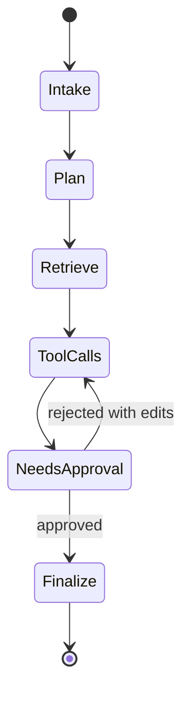

# Layer 3: Agent Frameworks

## Beginner explanation

An agent framework gives structure to multi-step work. Instead of one model call, you define state, nodes, transitions, tool use, retries, and completion rules.

## Production explanation

In production, orchestration matters more than the label “agent.” Teams need deterministic state transitions, checkpointing, timeout policy, human approval gates, and replayable traces.

## Enterprise example

A sales operations assistant receives a request to prepare an account brief. It gathers CRM data, retrieves notes, asks for human approval before sending anything externally, then produces a final package.

## Architecture diagram



## TypeScript example

```ts
type State = {
  goal: string;
  evidence: string[];
  approvalGranted: boolean;
  result?: string;
};

export async function finalize(state: State): Promise<State> {
  if (!state.approvalGranted) {
    throw new Error('Approval required before finalize step.');
  }

  return {
    ...state,
    result: `Prepared brief with ${state.evidence.length} evidence items.`,
  };
}
```

## Python example

```python
from dataclasses import dataclass, field

@dataclass
class WorkflowState:
    goal: str
    evidence: list[str] = field(default_factory=list)
    approval_granted: bool = False
    result: str | None = None
```

## Common mistakes

- treating the agent loop as invisible prompt magic
- missing a hard stop for dangerous or expensive behavior
- not persisting intermediate state
- no distinction between tool error and model error

## Mini exercise

Model a four-step workflow with explicit state and a single approval gate. Write down the transition conditions in code comments or a Mermaid state diagram.

## Project assignment

Implement planning, state transitions, and one approval gate in [Project: Agent Workflow Orchestrator](./project-langgraph-orchestrator.md).

## Interview questions

- When do you need a graph or state machine instead of a simple request pipeline?
- What state would you persist between steps?
- Where should human approvals live in the workflow?

## Monetization angle

Workflow orchestration is a high-value consulting capability because organizations want AI automation, but only when execution is inspectable and governable.
