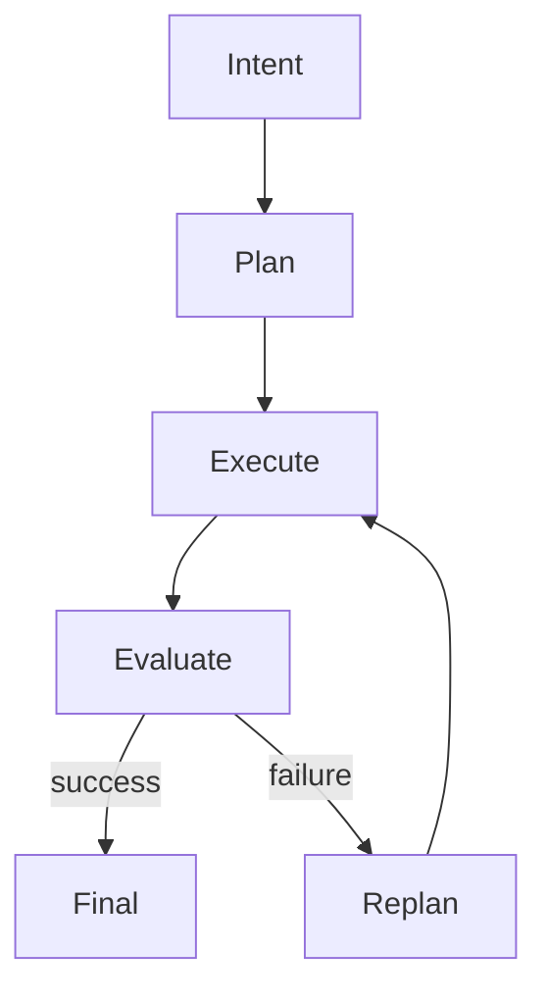

# Layer 3: Agent Frameworks

Agent frameworks help you build workflows where the model can plan, use tools, remember state, and recover from failure.

## Framework categories

| Type | Examples | Best for |
|---|---|---|
| Graph-based | LangGraph | controllable workflows |
| Crew-based | CrewAI | role-based collaboration |
| SDK-based | OpenAI Agents SDK | provider-native agents |
| Enterprise ecosystem | Google ADK, Microsoft Agent Framework | enterprise integration |

## Agentic loop

