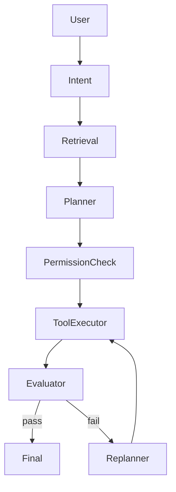

# Project: Agent Workflow Orchestrator

## Goal

Build a graph-based orchestrator that can plan, execute tools, evaluate results, and replan.

## Workflow

## Features

- state object
- nodes
- conditional edges
- retries
- failure handling
- approval gate
- trace view

## Portfolio output

Create a visual trace page showing each agent step.
