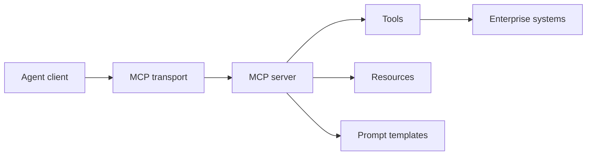

# MCP Server and Client Basics

## Beginner explanation

MCP is a protocol for exposing capabilities like tools, prompts, and resources to compatible clients. It helps agent clients connect to external systems through a standard interface.

## Production explanation

The value of MCP in production is consistency. Instead of every client inventing a custom integration shape, MCP lets platform teams expose stable capability contracts and centralize policy, auth, and observability.

## Real-world enterprise example

A company exposes an internal knowledge search tool, deployment status resource, and incident template through one MCP server so different AI clients can use the same trusted interfaces.

## Mermaid diagram



## TypeScript example

```ts
export const serverCapabilities = {
  tools: ['search_incidents', 'read_change_request'],
  resources: ['deployment://latest', 'runbook://incident-sev1'],
  prompts: ['incident-summary'],
};
```

## Python example

```python
def resource_uri(kind: str, identifier: str) -> str:
    return f"{kind}://{identifier}"
```

## Common mistakes

- exposing transport details instead of clean business capabilities
- not distinguishing tools from static resources
- assuming protocol standardization removes the need for auth and approvals
- publishing tools without documentation for consumers

## Mini exercise

Design one MCP server for a support ops domain. List two tools, one resource, and one prompt template.

## Project assignment

Create the initial capability map for [Project: MCP Enterprise Toolkit](./project-mcp-enterprise-toolkit.md).

## Interview questions

- What problem does MCP solve for agent platforms?
- When should something be exposed as a resource instead of a tool?
- Why does standardization not eliminate governance concerns?

## Monetization angle

Standardized enterprise integrations are highly reusable. An MCP capability layer can become a strategic internal platform and a repeatable service offering.
