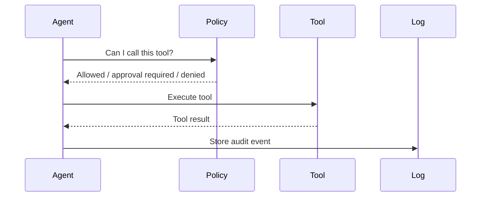

# Layer 4: Tool Calling and MCP

Agents become useful when they can call tools.

## Tool examples

- search documents
- read Jira tickets
- create test plans
- run browser tests
- query database
- send notifications
- update workflows

## Tool lifecycle

