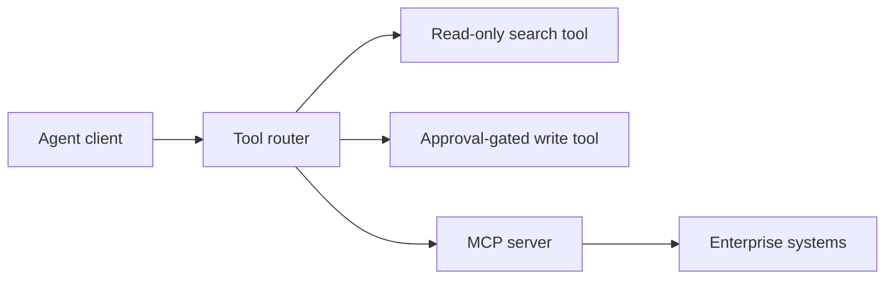

# Layer 4: Tool Calling and MCP

## Beginner explanation

Tool calling lets a model ask software to do something concrete: fetch data, search knowledge, create a ticket, or trigger a workflow. MCP standardizes how tools, resources, and prompts are exposed to capable clients.

## Production explanation

The hard part is not exposing tools. The hard part is defining safe schemas, approval rules, auth boundaries, failure semantics, and audit trails. MCP becomes especially valuable when many tools need a stable interface across clients.

## Enterprise example

A procurement agent can search vendor policy, look up contract metadata, and draft purchase requests, but it cannot submit the final request without an approval step.

## Architecture diagram



## TypeScript example

```ts
export const searchPolicyTool = {
  name: 'search_policy',
  description: 'Search procurement policy and return grounded excerpts.',
  inputSchema: {
    type: 'object',
    properties: {
      query: { type: 'string' },
    },
    required: ['query'],
    additionalProperties: false,
  },
};
```

## Python example

```python
def require_approval(tool_name: str) -> bool:
    return tool_name in {"create_purchase_request", "approve_vendor_change"}
```

## Common mistakes

- exposing low-level tools instead of task-level tools
- making tool arguments too flexible
- letting the agent write before it can read and reason
- skipping permission checks because the model “should know better”

## Mini exercise

Design three tools for an internal help desk agent: one read-only, one approval-gated, and one fully blocked in production.

## Project assignment

Create an MCP server with at least two read tools and one gated write tool in [Project: MCP Enterprise Toolkit](./project-mcp-enterprise-toolkit.md).

## Interview questions

- What makes a good tool schema for LLM consumption?
- Why is MCP useful for enterprise agent platforms?
- Which tools should never be directly exposed to a model?

## Monetization angle

Organizations need reusable tool platforms more than one-off chatbots. A well-scoped MCP toolkit can become an internal platform product or a repeatable delivery offer.
