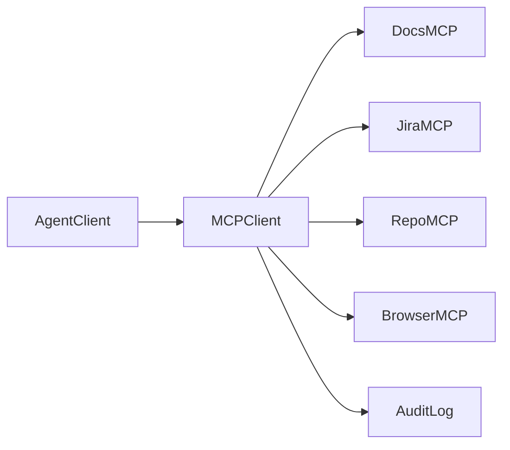

# Project: MCP Enterprise Toolkit

## Goal

Create a collection of safe enterprise MCP tools.

## Tools

| Tool | Mode | Risk |
|---|---|---|
| Docs Search | read-only | low |
| Jira Search | read-only | low |
| GitHub/Bitbucket Search | read-only | low |
| Database Query | read-only | medium |
| Browser Test Runner | approval-gated | medium |

## Architecture

