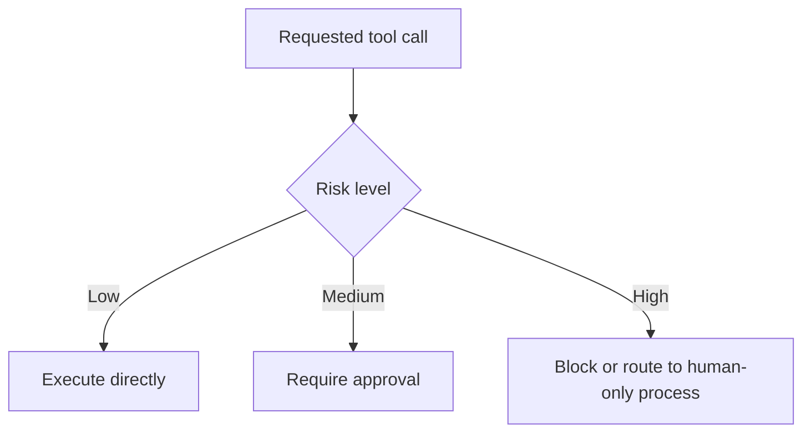

# Tool Calling Patterns

## Beginner explanation

Not all tools should be treated the same. Good agent systems classify tools by risk and design the workflow around that risk.

## Production explanation

The safest pattern is to start with read-only tools, then add approval-gated write tools, and keep dangerous or irreversible actions highly restricted or fully human-owned.

## Real-world enterprise example

A release assistant can read deployment history and incident notes directly, but asking it to trigger a production rollback requires approval and a verified operator identity.

## Mermaid diagram



## TypeScript example

```ts
export interface AgentTool {
  name: string;
  description: string;
  riskLevel: 'low' | 'medium' | 'high';
  requiresApproval: boolean;
}
```

## Python example

```python
def execution_mode(risk_level: str) -> str:
    if risk_level == "low":
        return "direct"
    if risk_level == "medium":
        return "approval"
    return "blocked"
```

## Common mistakes

- giving a model direct mutation rights too early
- exposing low-level administrative tools instead of business-scoped actions
- forgetting that “send email” can still be high impact
- encoding approval only in a prompt instead of application logic

## Mini exercise

Classify ten candidate tools for your project into low, medium, and high risk. Justify each classification in one line.

## Project assignment

Add a risk matrix for tools in [Project: MCP Enterprise Toolkit](./project-mcp-enterprise-toolkit.md) or [Project: Agent Workflow Orchestrator](../03-agent-frameworks/project-langgraph-orchestrator.md).

## Interview questions

- Why is read-only a good default for early tool adoption?
- What makes a tool high risk even if it is technically simple?
- Where should tool approval logic live?

## Monetization angle

Safe tool design is often where enterprise trust is won. Teams pay for integrations that are useful without creating operational risk.
