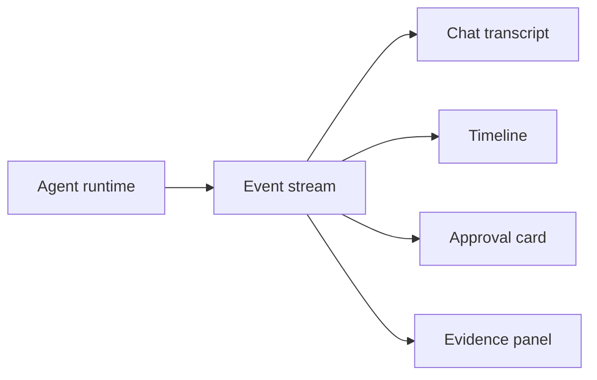

# AG-UI Event Streams

## Beginner explanation

Agentic frontends should consume structured events, not only final text. Events let the UI show progress, tools, approvals, and failures as they happen.

## Production explanation

An event stream becomes the contract between runtime and interface. If it is stable and typed, multiple UIs can render the same agent behavior consistently and observably.

## Real-world enterprise example

A QA browser agent emits events for plan creation, page navigation, screenshot capture, assertion failure, approval pause, and final bug report generation.

## Mermaid diagram



## TypeScript example

```ts
export type AgentEvent =
  | { type: 'message.delta'; text: string }
  | { type: 'plan.created'; steps: string[] }
  | { type: 'tool.started'; toolName: string; input: unknown }
  | { type: 'tool.completed'; toolName: string; result: unknown }
  | { type: 'approval.requested'; approvalId: string; reason: string }
  | { type: 'agent.completed'; finalAnswer: string };
```

## Common mistakes

- mixing UI-only formatting into the runtime payload
- not versioning event types as the product evolves
- sending only text deltas and losing operational state
- failing to include identifiers for approvals and tool runs

## Mini exercise

Define an event list for a three-step agent workflow and map each event to one UI component.

## Project assignment

Implement an event contract for [Project: Angular Agentic Copilot](./project-angular-agentic-copilot.md).

## Interview questions

- Why are event streams better than raw log text for agent UIs?
- Which events should be persisted for replay?
- How would you evolve the event schema without breaking old clients?

## Monetization angle

Typed event streams make AI interfaces more reusable. That helps product teams ship new copilots faster and helps consultants package UI infrastructure as a repeatable asset.
