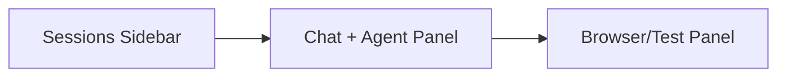

# Angular Copilot UX Patterns

## Layout

## Required components

- `CopilotShellComponent`
- `SessionSidebarComponent`
- `ChatThreadComponent`
- `ToolTimelineComponent`
- `ApprovalCardComponent`
- `BrowserPanelComponent`
- `ModelSelectorComponent`
- `ModeSelectorComponent`

## Modes

| Mode | Behavior |
|---|---|
| Ask | answer only |
| Plan | create plan, no execution |
| Agent | plan and execute with approvals |
