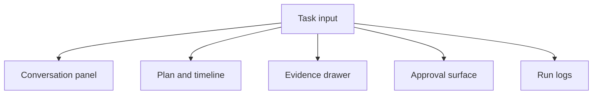

# Angular Copilot UX Patterns

## Beginner explanation

An agentic copilot UI needs more than a chat box. It should make long-running work understandable and controllable.

## Production explanation

Good copilot UX separates conversational input from operational state. Users should be able to see the plan, current step, evidence, approvals, and failure recovery options without reading a wall of text.

## Real-world enterprise example

A support supervisor uses a copilot to investigate escalations. The UI shows the request, current tool activity, retrieved evidence, confidence cues, and any pending approval before the agent can message the customer.

## Mermaid diagram



## TypeScript example

```ts
export interface CopilotLayoutState {
  activeSessionId: string;
  selectedEvidenceId?: string;
  pendingApprovalId?: string;
  showRunLogs: boolean;
}
```

## Common mistakes

- forcing users to parse the entire workflow from chat messages
- hiding approvals or evidence under secondary screens
- not designing empty, loading, and failure states intentionally
- treating mobile responsiveness as an afterthought

## Mini exercise

Sketch a layout with five surfaces: input, transcript, timeline, evidence, and approvals. Decide which surface is primary on mobile.

## Project assignment

Apply these surfaces in [Project: Angular Agentic Copilot](./project-angular-agentic-copilot.md).

## Interview questions

- What UI surfaces are essential for an agentic product?
- How should approval UX differ from normal chat output?
- Why is evidence visibility part of trust, not just convenience?

## Monetization angle

Copilot UX patterns are transferable across industries. That makes them strong material for a design system, starter kit, or front-end consulting offer.
