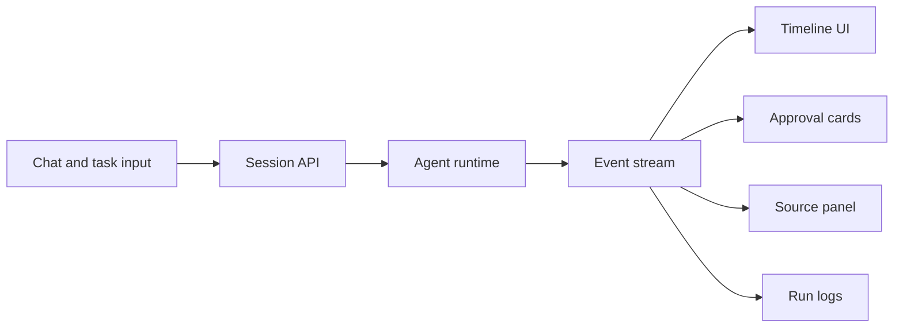

# Layer 5: Agentic UI

## Beginner explanation

Agentic UI is the interface layer for AI work that takes multiple steps. It must show progress, evidence, approvals, failures, and final output, not just a chat bubble.

## Production explanation

In production, the UI is where trust is won or lost. If users cannot see what the agent is doing, which sources it used, why it paused, or how to recover from failure, the system will not be adopted.

## Enterprise example

A QA lead asks an agent to test a staging environment. The UI shows the test plan, browser execution timeline, screenshots, console logs, failure trace, and a final bug report with severity labels.

## Architecture diagram



## TypeScript example

```ts
type AgentEvent =
  | { type: 'plan.created'; steps: string[] }
  | { type: 'tool.started'; toolName: string }
  | { type: 'approval.required'; requestId: string; summary: string };

export function reduceEvents(events: AgentEvent[]) {
  return events.map((event, index) => ({ ...event, order: index + 1 }));
}
```

## Common mistakes

- building only a chat input and transcript
- hiding approvals inside raw text
- not preserving run history
- no visual distinction between model output and tool evidence

## Mini exercise

Design the event types for an agent that retrieves documents, calls one tool, asks for approval, and returns a final result.

## Project assignment

Add timeline, approval, and source panels to [Project: Angular Agentic Copilot](./project-angular-agentic-copilot.md).

## Interview questions

- What should an operator see during a long-running agent task?
- How would you represent approval state in the UI?
- Why is source traceability important for enterprise adoption?

## Monetization angle

Most teams can build prompts faster than they can build trustworthy AI interfaces. Agentic UI is a strong niche for productized consulting and premium starter kits.
