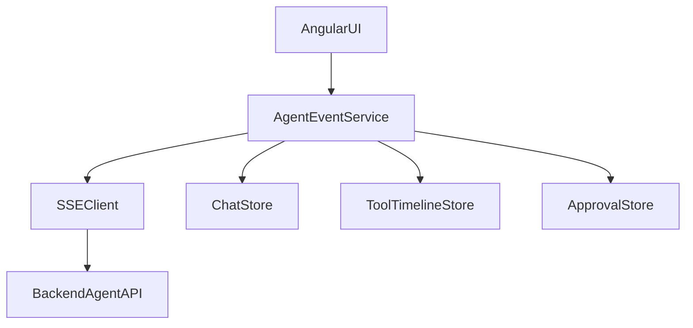

# Project: Angular Agentic Copilot

## Goal

Build a production-style Angular copilot UI for agentic applications.

## Features

- collapsible session sidebar
- ChatGPT/Codex-style layout
- resizable chat panel
- browser panel
- streaming events
- tool timeline
- approval cards
- dark/light theme
- model selector
- mode selector
- environment selector

## Architecture

