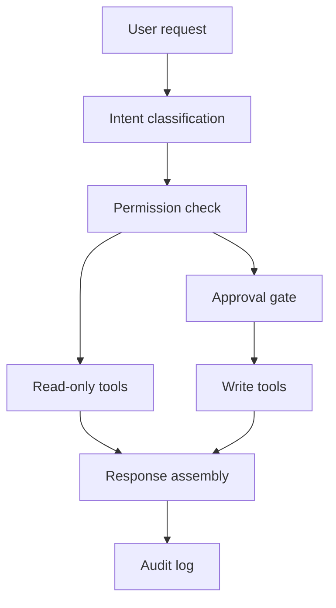

# Layer 6: Production and Security

## Beginner explanation

Security for agentic systems means controlling what the model can see, do, and approve. The moment an agent can call tools or read untrusted content, you need explicit boundaries.

## Production explanation

Production security includes prompt injection defense, permission models, approval checkpoints, tenant isolation, logging, secret handling, and damage containment. Security is not a final checklist item; it shapes architecture early.

## Enterprise example

A finance ops agent can read invoice data and draft payment summaries, but only a human can approve payment release. Every write action is scoped by role and logged with evidence.

## Architecture diagram



## TypeScript example

```ts
export function assertToolPermission(userRole: string, toolName: string) {
  const writeTools = new Set(['create_invoice_note', 'release_payment']);
  if (writeTools.has(toolName) && userRole !== 'finance_admin') {
    throw new Error(`Role ${userRole} cannot execute ${toolName}`);
  }
}
```

## Python example

```python
def sanitize_untrusted_context(text: str) -> str:
    return text.replace("ignore previous instructions", "[redacted prompt injection phrase]")
```

## Common mistakes

- giving the model direct access to high-impact tools
- mixing untrusted retrieved content with system policy without boundaries
- logging secrets in traces
- approving actions through vague natural-language output instead of structured state

## Mini exercise

Classify your planned tools into `read`, `write`, `dangerous`, and `human-only`. Add a justification for each category.

## Project assignment

Add a permission matrix and one human approval workflow to any existing project, then document the threat model.

## Interview questions

- What is prompt injection in an enterprise RAG context?
- Why should approvals be represented as structured workflow state?
- How do you limit blast radius when an agent fails?

## Monetization angle

Security and governance are often the budget unlock for enterprise AI projects. Teams pay for systems that move from “interesting demo” to “safe to pilot.”
