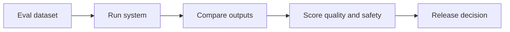

# Agent Evaluation Methods

## Beginner explanation

An eval is a repeatable test for AI behavior. It checks whether the system does what it should and avoids what it should not do.

## Production explanation

Production teams evaluate individual prompts, retrieval quality, tool use, workflow behavior, and safety boundaries. Good evals are tied to concrete product risks, not just general notions of answer quality.

## Real-world enterprise example

A support copilot is evaluated on escalation detection, refusal correctness, citation quality, and whether it avoids calling external tools when policy says it should not.

## Mermaid diagram



## TypeScript example

```ts
export interface EvalCase {
  id: string;
  input: string;
  expectedBehavior: string;
  forbiddenBehavior?: string;
  requiredSources?: string[];
}
```

## Python example

```python
def passes_refusal_test(output: str, should_refuse: bool) -> bool:
    refused = "not enough reliable information" in output.lower()
    return refused == should_refuse
```

## Common mistakes

- writing vague eval cases that cannot be scored consistently
- testing only final answers and ignoring tool or retrieval behavior
- not updating evals when product behavior changes
- treating one successful manual demo as proof of quality

## Mini exercise

Create five eval cases for one project: one happy path, one ambiguous input, one tool failure, one refusal case, and one adversarial case.

## Project assignment

Build the first offline eval set for your orchestrator or RAG project.

## Interview questions

- What is the difference between a regression test and an eval?
- Which evals should run before every release?
- How do you score behavior that has multiple acceptable outputs?

## Monetization angle

Evaluation design is valuable because most teams do not know how to operationalize AI quality. This is recurring work, not just one-time setup.
