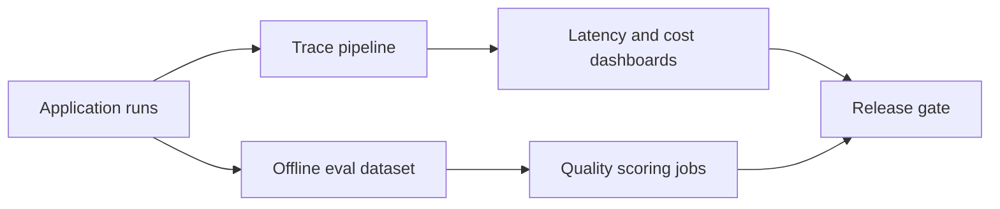

# Layer 7: Evals and Observability

## Beginner explanation

If you cannot measure quality, you cannot ship with confidence. Evals tell you whether the system behaves correctly. Observability tells you what happened when it did not.

## Production explanation

Agentic systems need both offline and online measurement: retrieval quality, schema adherence, tool success rate, latency, cost, approval frequency, and user override rate. Teams that skip this end up debugging anecdotes.

## Enterprise example

A legal document assistant is evaluated on citation accuracy, refusal correctness, latency, and cost per task before it is allowed into a broader pilot.

## Architecture diagram



## TypeScript example

```ts
type TraceRecord = {
  runId: string;
  latencyMs: number;
  costUsd: number;
  toolErrors: number;
};

export function shouldAlert(trace: TraceRecord) {
  return trace.latencyMs > 8000 || trace.costUsd > 0.2 || trace.toolErrors > 0;
}
```

## Python example

```python
def score_grounding(answer: str, citations: list[str]) -> float:
    return 1.0 if answer and citations else 0.0
```

## Common mistakes

- measuring only thumbs-up and thumbs-down
- shipping retrieval without retrieval evals
- not storing enough trace context to reproduce failure
- watching average latency instead of percentile latency

## Mini exercise

Define five metrics for one of your projects: one quality metric, one reliability metric, one cost metric, one speed metric, and one safety metric.

## Project assignment

Create a trace schema and a lightweight offline eval dataset for your RAG or orchestration project.

## Interview questions

- What is the difference between an eval and an application metric?
- Which metrics matter most for a tool-using agent?
- How would you gate a release using eval results?

## Monetization angle

Organizations quickly realize that AI reliability is an ongoing operations problem. Evals and observability can become a premium implementation layer or recurring service.
