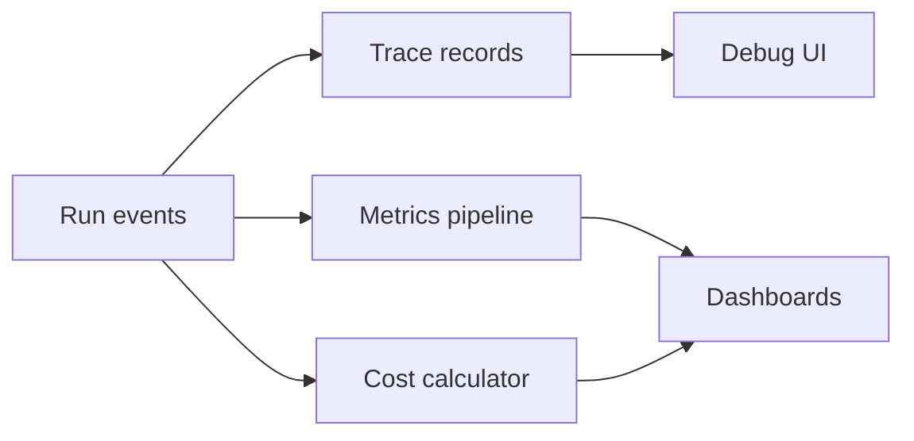

# Traces, Metrics, and Costs

## Beginner explanation

Traces tell the story of one run. Metrics summarize many runs. Cost tracking shows whether the product economics make sense.

## Production explanation

Agentic systems need visibility into model calls, tool calls, retrieval quality, approval pauses, error paths, token usage, and per-task cost. Otherwise debugging and budgeting become guesswork.

## Real-world enterprise example

A claims assistant traces every workflow step, including retrieval hit count, tool latency, approval duration, and final model cost. Operations uses this to find slow, expensive, or failure-prone paths.

## Mermaid diagram



## TypeScript example

```ts
export interface TraceRecord {
  runId: string;
  step: string;
  latencyMs: number;
  costUsd: number;
  error?: string;
}
```

## Python example

```python
def total_run_cost(costs: list[float]) -> float:
    return round(sum(costs), 4)
```

## Common mistakes

- storing only the final answer and not the steps that created it
- tracking average latency without percentiles
- ignoring tool cost and retrieval cost in total spend
- no run identifier shared across services

## Mini exercise

Design the trace schema for one full workflow run, including IDs, timestamps, step names, and error fields.

## Project assignment

Add a trace record format and dashboard metric list to your main project.

## Interview questions

- What is the difference between a trace and a metric?
- Which cost signals matter most during early rollout?
- How would you investigate a run that was correct but too slow?

## Monetization angle

Observability is part of making AI sustainable in production. It supports platform work, managed services, and enterprise support retainers.
