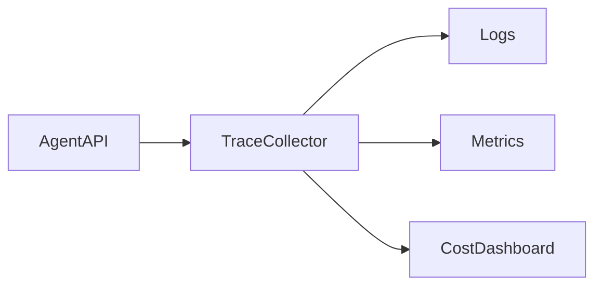

# Traces, Metrics, and Costs

## Trace fields

- trace ID
- user ID
- session ID
- model
- prompt tokens
- completion tokens
- tool calls
- duration
- error details

## Trace architecture

```mermaid
flowchart LR
  AgentAPI --> TraceCollector
  TraceCollector --> Logs
  TraceCollector --> Metrics
  TraceCollector --> CostDashboard
```
