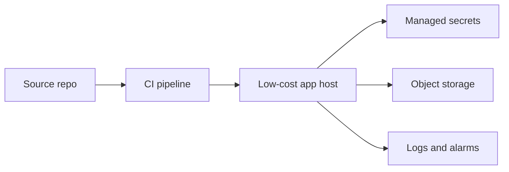

# AWS Free-Tier Path

## Beginner explanation

The goal of a free-tier deployment path is not perfect scale. It is to give learners a realistic path to host demos, APIs, and small internal tools without large upfront cost.

## Production explanation

Even a low-cost environment should still teach environment separation, secret management, logging, and rollback awareness. The point is operational practice, not just cheap hosting.

## Real-world enterprise example

A learner deploys an AI gateway and small RAG demo to a low-cost environment with managed secrets, object storage for documents, and basic monitoring.

## Suggested path

1. Host a simple API container.
2. Add environment variables and secret management.
3. Store uploaded source documents separately from the app runtime.
4. Add logs, health checks, and a basic staging path.

## Mermaid diagram

## Common mistakes

- using one environment for everything
- hardcoding provider keys into the app
- ignoring document storage and lifecycle
- not estimating cost before enabling usage

## Mini exercise

Map one project to cloud components: app host, storage, secrets, logs, and optional database.

## Project assignment

Write a one-page deployment plan for one project using a low-cost cloud setup.

## Interview questions

- What should be separated even in a low-cost deployment?
- Where do AI apps tend to incur unexpected cloud cost?
- Why is object storage useful for RAG projects?

## Monetization angle

Low-cost deployment paths help learners publish faster and help consultants offer a smaller pilot package before a broader enterprise rollout.
