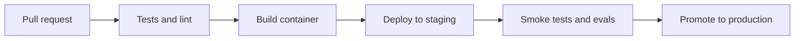

# Docker and CI/CD

## Beginner explanation

Docker packages the app and its runtime. CI/CD automates test, build, and deployment steps so releases are repeatable.

## Production explanation

Agentic apps often depend on more than a Node server: vector databases, background jobs, browser runtimes, and provider credentials. CI/CD should validate these dependencies before production rollout.

## Real-world enterprise example

A QA agent API runs in containers, its browser automation dependency is validated in CI, and staging deployment runs smoke tests before production promotion.

## Mermaid diagram



## TypeScript example

```ts
export function healthcheck() {
  return {
    status: 'ok',
    providerConfigured: Boolean(process.env.OPENAI_API_KEY),
  };
}
```

## Python example

```python
def smoke_test() -> bool:
    return True
```

## Common mistakes

- assuming local success means container success
- deploying prompt or retrieval changes without a staging gate
- no smoke tests for external dependencies
- not documenting required environment variables

## Mini exercise

Write the CI stages for one project and identify which checks should block production.

## Project assignment

Document a container plan and CI gate list for your chosen project.

## Interview questions

- What should a smoke test validate for an AI application?
- Why do prompt changes deserve release discipline?
- What dependencies are easiest to miss in CI?

## Monetization angle

Productionization work is often easier to sell than greenfield experimentation because it directly reduces risk and improves delivery confidence.
