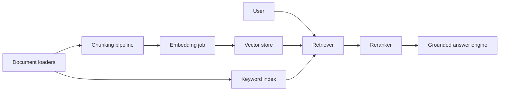

import ProjectStatusCard from '@site/src/components/ProjectStatusCard';

# Project: Enterprise RAG Copilot

- **Difficulty:** Intermediate to advanced
- **Primary stack:** TypeScript API, Python ingestion pipeline
- **Estimated duration:** 2 to 3 weeks
- **Primary hiring signal:** retrieval system design
- **Primary monetization signal:** internal knowledge assistant

## Problem statement

Employees waste time hunting through fragmented documentation. The copilot should answer from trusted sources with citations.

## Project implementation

<ProjectStatusCard
  project="Enterprise RAG Copilot"
  status="Runnable"
  folderHref="https://github.com/AnkitParekh007/Agentic-Engineering-Playbook/tree/main/projects/p02-enterprise-rag-copilot"
  stack={['TypeScript', 'Express', 'Hybrid retrieval', 'Zod']}
  commands={[
    'npm install',
    'npm run typecheck',
    'npm run build',
    'npm run smoke',
    'npm run eval',
  ]}
  proves="A local-first RAG pipeline can ingest docs, rank chunks, cite sources, and measure retrieval quality before any vector database is added."
  next="Replace deterministic scoring with embeddings, add a vector store, and route answer generation through Project 01."
/>

## Core workflows

- ingest documents with metadata
- create chunks and embeddings
- run hybrid retrieval and reranking
- generate grounded answers with citations
- evaluate retrieval and answer quality

## Architecture

## Milestones

1. Ingest a small document set with metadata
2. Add hybrid retrieval and citation formatting
3. Add reranking and refusal behavior for missing evidence
4. Add eval set and dashboard metrics

## Acceptance criteria

- every answer cites one or more source chunks
- the system refuses unsupported claims
- retrieval can be debugged with source metadata
- at least one offline eval dataset exists

## Starter implementation

Starter code is now available in [`projects/p02-enterprise-rag-copilot`](https://github.com/AnkitParekh007/Agentic-Engineering-Playbook/tree/main/projects/p02-enterprise-rag-copilot). The current starter uses local JSON storage plus deterministic hybrid scoring so learners can understand the pipeline before adding embeddings or a vector database.

The starter also includes a minimal eval dataset in `evals/questions.json` so learners can measure retrieval quality before adding more advanced ranking and generation layers.

## Portfolio packaging

Publish screenshots of answers with citations, retrieval debug views, and a diagram of the ingestion pipeline.

## Monetization path

This is directly monetizable as a departmental copilot, enterprise pilot, or ingestion-and-search accelerator.
