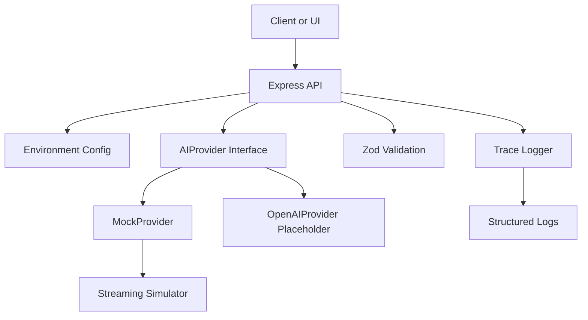

# Project 01 Architecture

This starter is intentionally small, but the shape mirrors a real AI gateway service.

## Request flow

## Design notes

- The HTTP layer does not know provider-specific details.
- The provider interface keeps chat, streaming, and structured output behavior consistent.
- Zod validation protects the API contract when a caller expects machine-readable JSON.
- Trace logs keep the starter observable from the first day.
- The mock path keeps the project runnable with no paid dependency.
