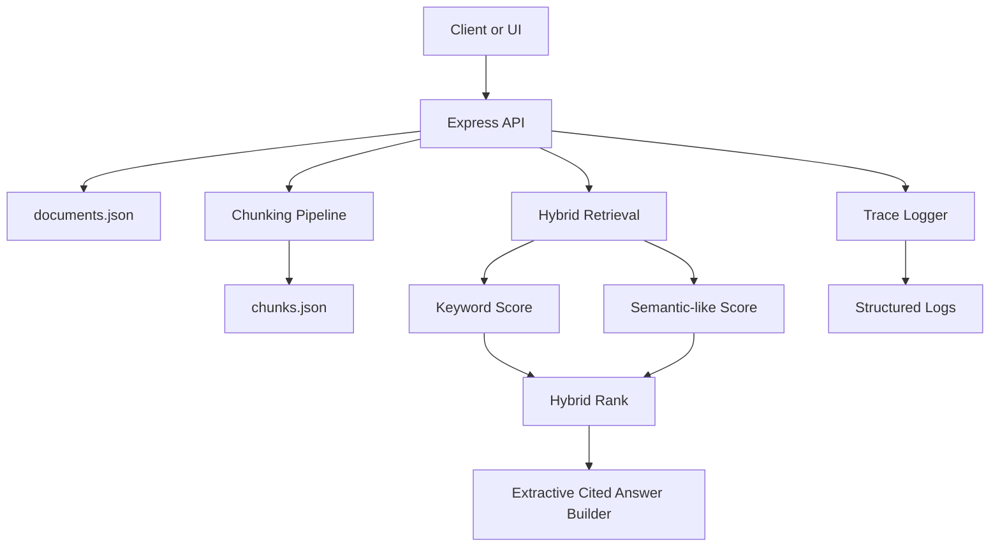

# Project 02 Architecture

This starter keeps the storage local and the retrieval deterministic so the full RAG flow stays easy to inspect.

The current answer layer is extractive and mock-first. It uses retrieved chunks directly instead of a live LLM call. That keeps the system runnable by default and sets up a clean future integration point with Project 01: AI Provider Gateway.

## Request flow

## Design notes

- local JSON files keep the starter easy to run and inspect
- chunk metadata is stored so retrieval results are debuggable
- hybrid scoring combines exact term overlap with deterministic semantic-like similarity
- the answer layer cites chunk IDs and document titles instead of inventing unsupported claims
- full answer generation can later be routed through Project 01 while keeping retrieval and citations intact
- traces log query, retrieval count, latency, confidence, and top chunk ID from day one
