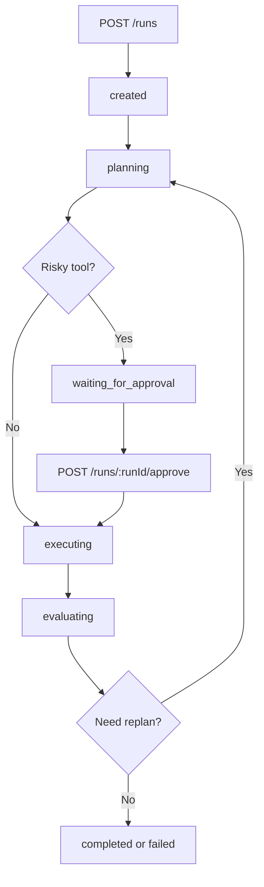
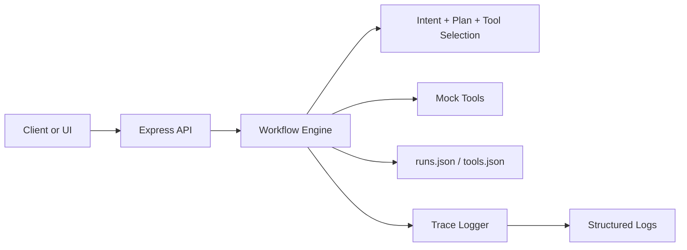

# Project 03 Architecture

This starter treats orchestration as an explicit state machine instead of a hidden prompt loop.

The traces are inspectable today. Replay from trace history is a future extension once the basic state transitions are well understood.

## Workflow overview

## Component flow

## Design notes

- runs are persisted locally so state can be inspected after each transition
- planning is deterministic and separate from execution
- safe tools can auto-run, while risky tools pause in `waiting_for_approval`
- evaluation decides whether to complete, retry, or fail
- traces capture approval metadata so review decisions are inspectable later
- replay from traces is a future extension, not part of the current starter
- future versions can replace the planner with Project 01 and add retrieval tools from Project 02
