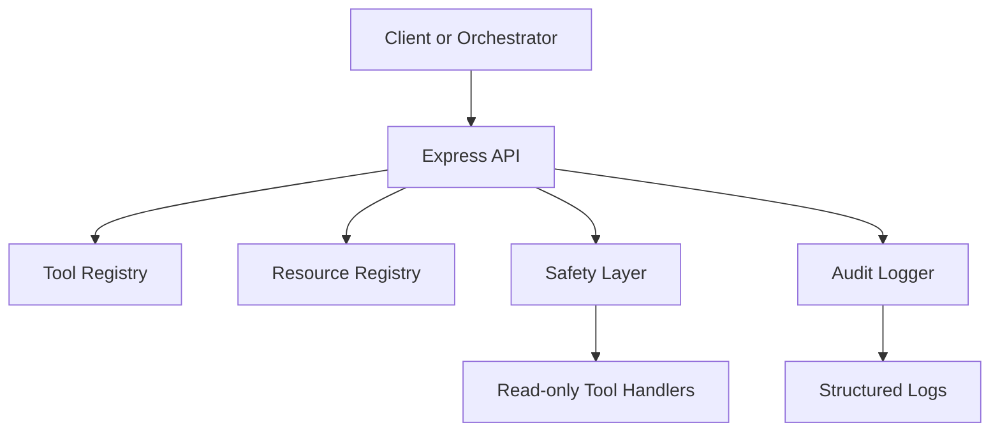
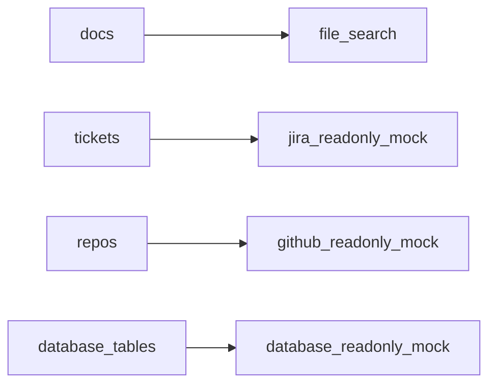
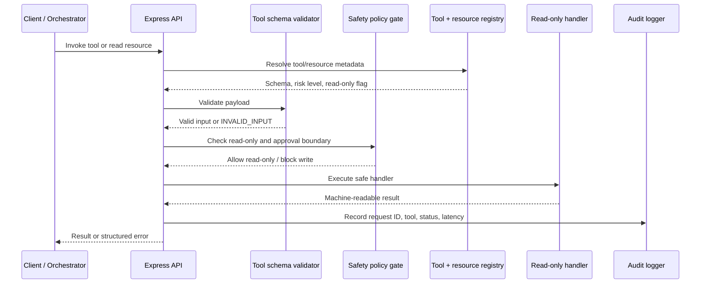

# Project 04 Architecture

This starter is a small MCP-style local server, not a full MCP implementation. The goal is to make the tool contract and safety boundary inspectable before adding transport or auth complexity.

## Request flow

## Resource view

## Tool, policy, and runtime flow

This view is the learner-facing safety contract: every invocation resolves metadata first, validates input before work starts, blocks writes in the policy gate, and records the outcome in audit logs.

## Design notes

- all tools are read-only in v1
- unknown tools are rejected before handler execution
- write operations are explicitly blocked
- input payloads are validated per tool
- audit logs capture request ID, tool name, success, latency, and result count
- a future version can replace this HTTP shape with a fuller MCP transport while keeping the same safety concepts

## Future extensions

- real MCP stdio transport
- MCP client examples
- auth
- approval-gated write tools
- persistent audit store
