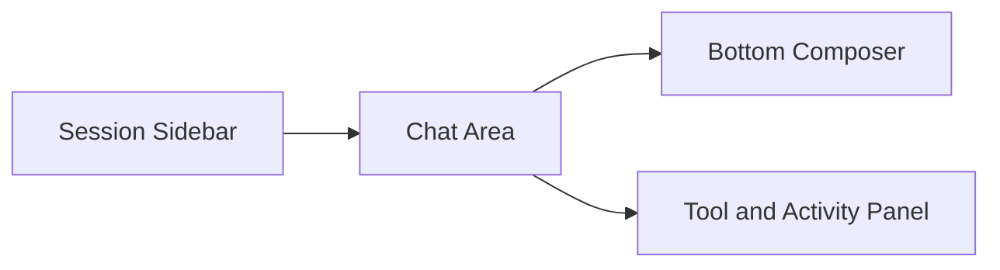
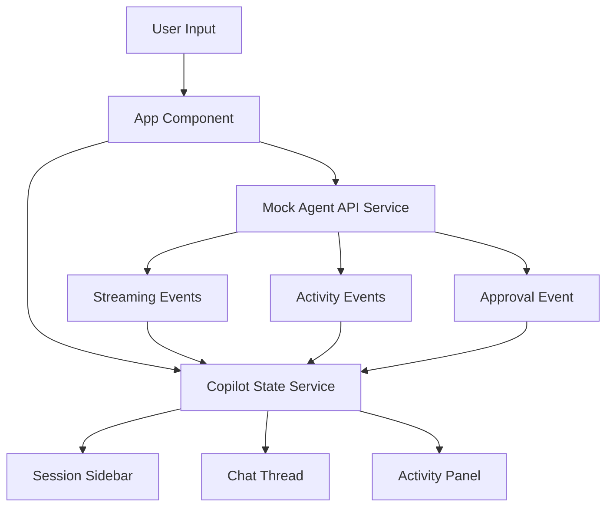

# Project 05 Architecture

This starter keeps the UI front-end only. The purpose is to teach agentic copilot UX before adding backend dependencies.

## Shell layout

## Front-end data flow

## Design notes

- the shell is intentionally similar to modern AI coding and chat products
- state is local and inspectable instead of hidden inside a complex store
- approvals are first-class UI objects, not side effects
- model and environment selectors are visible because operators need context
- future versions can replace the mock API with Project 01 through 04 integrations
