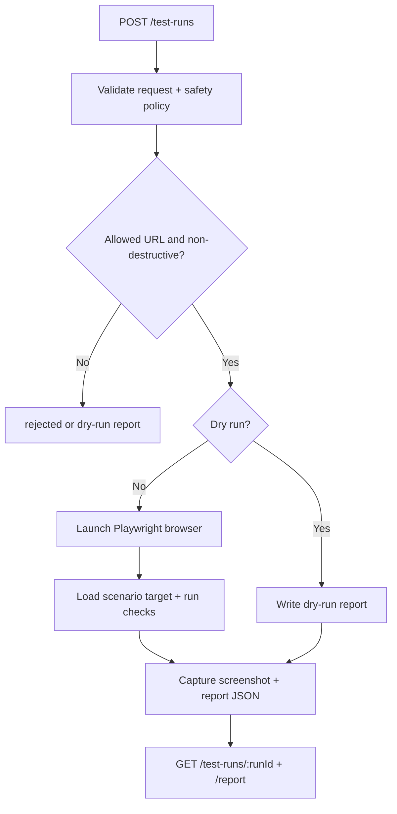
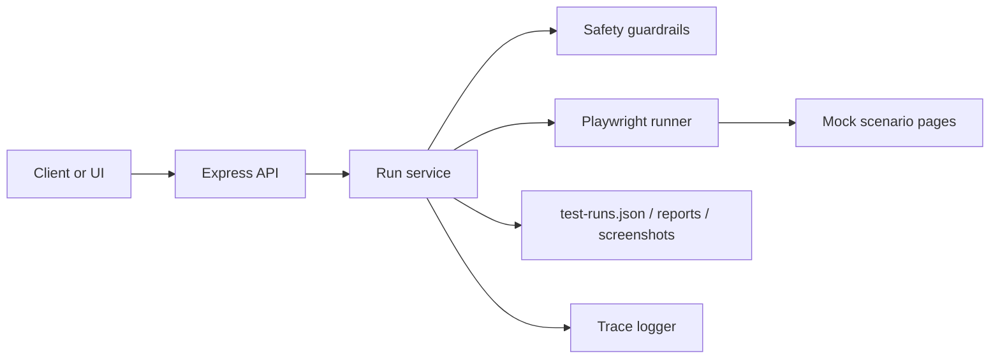

# Project 06 Architecture

This starter treats browser QA as a safe, local automation service instead of an unconstrained agent.

The current version is intentionally small: it uses Playwright, local files, mock-safe scenarios, and dry-run protections so learners can understand the execution model before adding real environments.

## Workflow overview

## Component flow

## Design notes

- `prod` is dry-run only by default
- destructive requests are blocked instead of executed
- only allowed hosts and `mock://` targets are accepted
- reports and screenshots stay local to the project
- evals stay deterministic by using temporary storage roots and dry-run-safe inputs
- future versions can connect this agent to Project 03 orchestration and Project 05 operator UI

## CI safety model

CI intentionally validates the service without requiring real browser targets or real production systems.

- `npm run smoke` checks the app and report pipeline with a dry-run-safe request
- `npm run eval` verifies policy behavior such as dry-run success, destructive-request blocking, and invalid URL rejection
- CI does not run `browser-smoke` by default because that path depends on a local Playwright browser install
- local developers can opt into `browser-smoke` after installing Chromium to confirm end-to-end screenshot capture
- generated reports and screenshots stay local, while the placeholder `.gitkeep` files preserve the folder structure in Git
